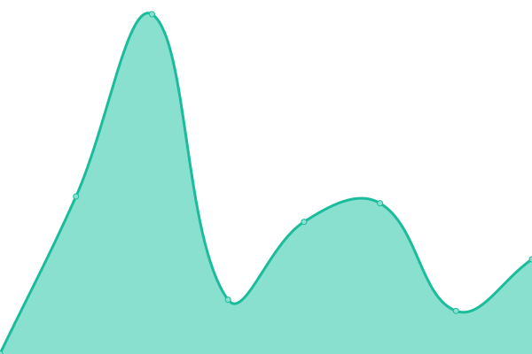

# [📈 Live Status](https://demo.upptime.js.org): <!--live status--> **🟩 All systems operational**

This repository contains the open-source uptime monitor and status page for [Cristian Berrios](https://xtn.cl), powered by [Upptime](https://github.com/upptime/upptime).

With [Upptime](https://upptime.js.org), you can get your own unlimited and free uptime monitor and status page, powered entirely by a GitHub repository. We use [Issues](https://github.com/equistene/upptime/issues) as incident reports, [Actions](https://github.com/equistene/upptime/actions) as uptime monitors, and [Pages](https://demo.upptime.js.org) for the status page.

<!--start: status pages-->
<!-- This summary is generated by Upptime (https://github.com/upptime/upptime) -->
<!-- Do not edit this manually, your changes will be overwritten -->
<!-- prettier-ignore -->
| URL | Status | History | Response Time | Uptime |
| --- | ------ | ------- | ------------- | ------ |
|  [Portafolio](https://portafolio.xtn.cl/) | 🟩 Up | [portafolio.yml](https://github.com/equistene/uptime-sites/commits/HEAD/history/portafolio.yml) | 

 465ms
     
 | 

<a href="https://status.xtn.cl/history/portafolio">100.00%</a>
    

|  [Polinomio](https://polinomio.cl/) | 🟩 Up | [polinomio.yml](https://github.com/equistene/uptime-sites/commits/HEAD/history/polinomio.yml) | 

 364ms
     
 | 

<a href="https://status.xtn.cl/history/polinomio">100.00%</a>
    

|  [Que Carne](https://quecarne.cl/) | 🟩 Up | [que-carne.yml](https://github.com/equistene/uptime-sites/commits/HEAD/history/que-carne.yml) | 

 439ms
     
 | 

<a href="https://status.xtn.cl/history/que-carne">100.00%</a>
    

|  [Unonuevedos](https://192.cl/) | 🟩 Up | [unonuevedos.yml](https://github.com/equistene/uptime-sites/commits/HEAD/history/unonuevedos.yml) | 

 280ms
     
 | 

<a href="https://status.xtn.cl/history/unonuevedos">100.00%</a>
    

<!--end: status pages-->

[**Visit our status website →**](https://demo.upptime.js.org)

## 📄 License

- Powered by: [Upptime](https://github.com/upptime/upptime)
- Code: [MIT](./LICENSE) © [Cristian Berrios](https://xtn.cl)
- Data in the `./history` directory: [Open Database License](https://opendatacommons.org/licenses/odbl/1-0/)
