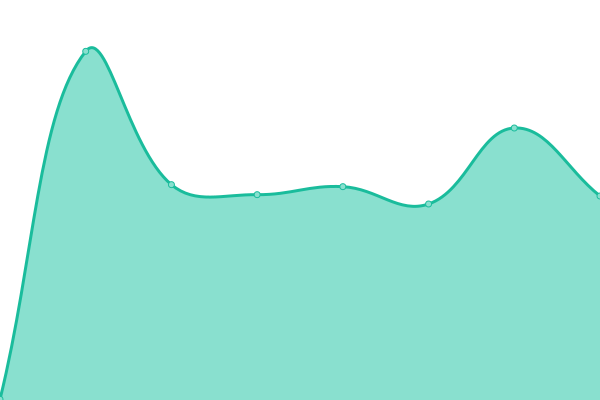

# [📈 Live Status](https://demo.upptime.js.org): <!--live status--> **🟧 Partial outage**

<!--start: status pages-->
<!-- This summary is generated by Upptime (https://github.com/upptime/upptime) -->
<!-- Do not edit this manually, your changes will be overwritten -->
<!-- prettier-ignore -->
| URL | Status | History | Response Time | Uptime |
| --- | ------ | ------- | ------------- | ------ |
|  [portafolio.xtn.cl](https://portafolio.xtn.cl/) | 🟩 Up | [portafolio-xtn-cl.yml](https://github.com/equistene/uptime-sites/commits/HEAD/history/portafolio-xtn-cl.yml) | 

 256ms
     
 | 

<a href="https://status.xtn.cl/history/portafolio-xtn-cl">100.00%</a>
    

|  [polinomio.cl](https://polinomio.cl/) | 🟥 Down | [polinomio-cl.yml](https://github.com/equistene/uptime-sites/commits/HEAD/history/polinomio-cl.yml) | 

 368ms
     
 | 

<a href="https://status.xtn.cl/history/polinomio-cl">76.24%</a>
    

|  [quecarne.cl](https://quecarne.cl/) | 🟥 Down | [quecarne-cl.yml](https://github.com/equistene/uptime-sites/commits/HEAD/history/quecarne-cl.yml) | 

 233ms
     
 | 

<a href="https://status.xtn.cl/history/quecarne-cl">100.00%</a>
    

|  [192.cl](https://192.cl/) | 🟩 Up | [192-cl.yml](https://github.com/equistene/uptime-sites/commits/HEAD/history/192-cl.yml) | 

 199ms
     
 | 

<a href="https://status.xtn.cl/history/192-cl">100.00%</a>
    

<!--end: status pages-->

[**Visit our status website →**](https://demo.upptime.js.org)

## 📄 License

- Powered by: [Upptime](https://github.com/upptime/upptime)
- Code: [MIT](./LICENSE) © [Cristian Berrios](https://xtn.cl)
- Data in the `./history` directory: [Open Database License](https://opendatacommons.org/licenses/odbl/1-0/)
